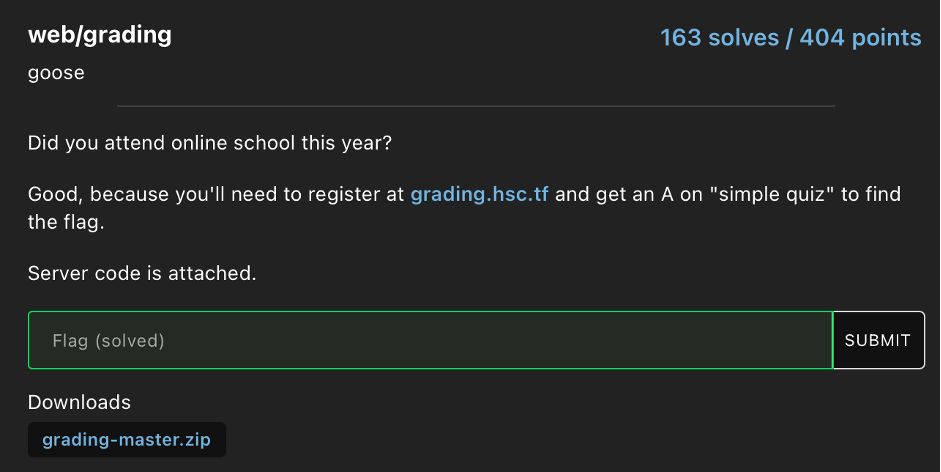
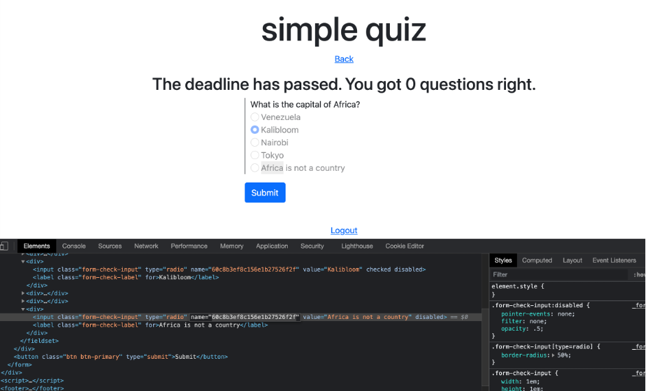
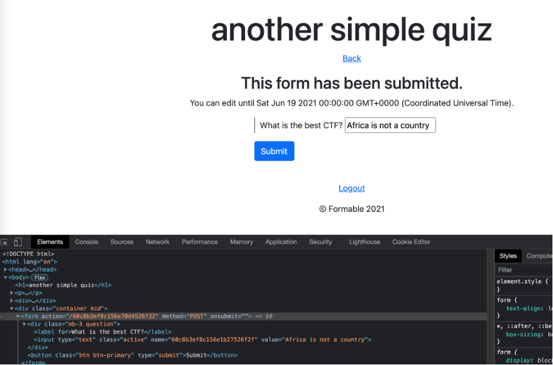
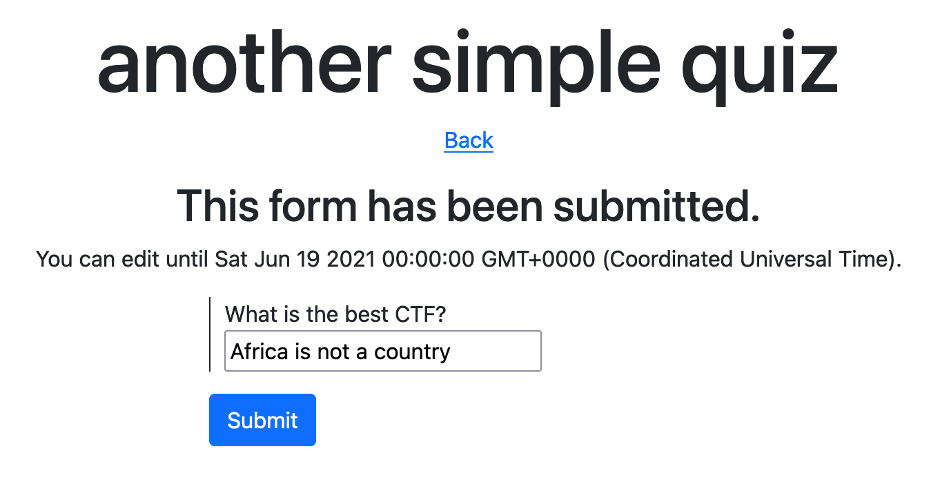
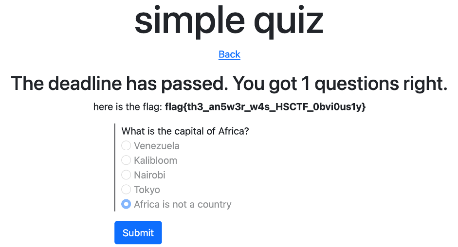

# HSCTF8 - grading

- Write-Up Author: Wendy \[[MOCTF](https://www.facebook.com/MOCSCTF)\]

- Flag:**flag{th3_an5w3r_w4s_HSCTF_0bvi0us1y}**
## **Question:**
grading



## Write up:

There are two quizzes on the page. The simple quiz is already ended and the another quiz is available for submission, our goal is to modify the answer and got the score. After analyzed the source code, we discover that we can modify the simple quiz's submission through questionID.
 
```
.post(authMW, (req, res) => {
    const now = Date.now()
    const form = req.user.forms.id(req.params.formID)
    if(now > form.deadline) {
        res.json({response: "too late"})
    } else {
        if(req.body.ID) {
            const question = req.user.questions.id(req.body.ID)
            console.log(question);
            question.submission = req.body.value
            req.user.save()
        } else {
            form.submitted = true
            req.user.save()
        }

        res.json({response: "heh"})
    }

})
```

First, we got the questionID from the simple quiz.



Then, we post the questionID and correct answer on the another simple quiz. 





Finally, we back to the simple quiz, we got the flag.



>flag{th3_an5w3r_w4s_HSCTF_0bvi0us1y}
