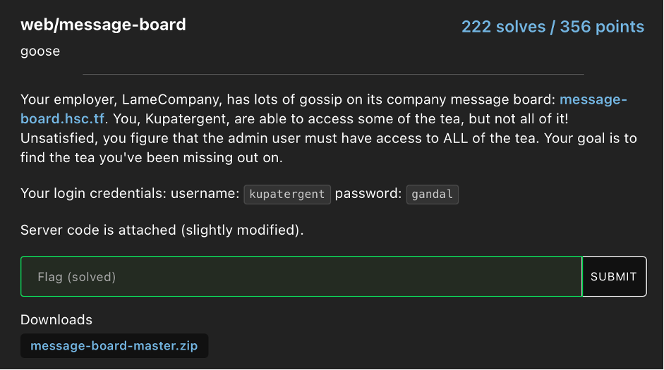
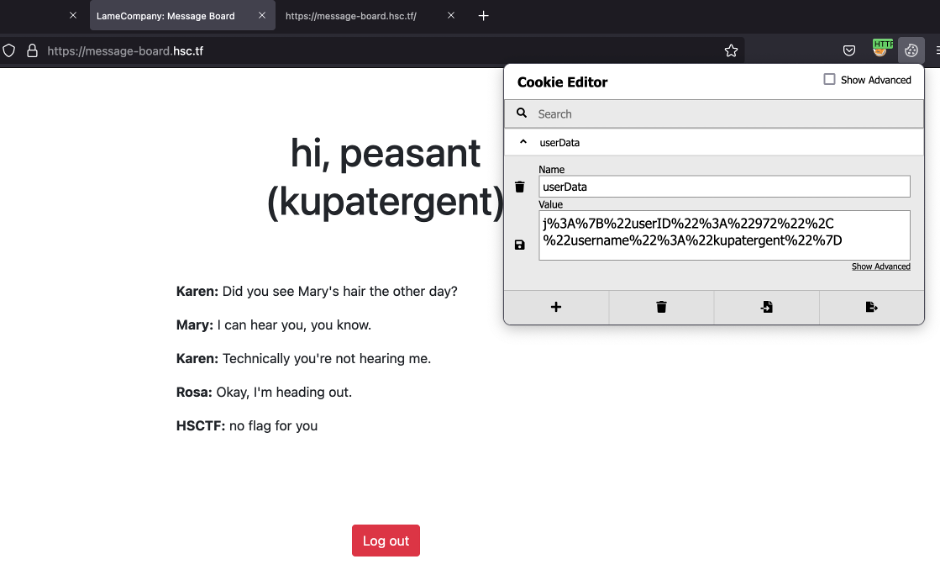
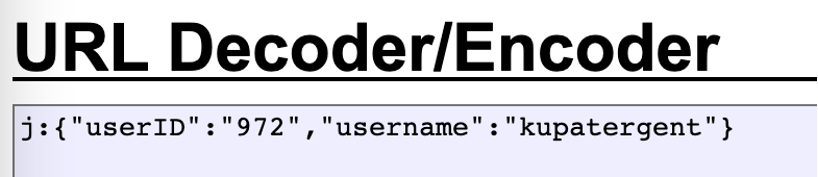
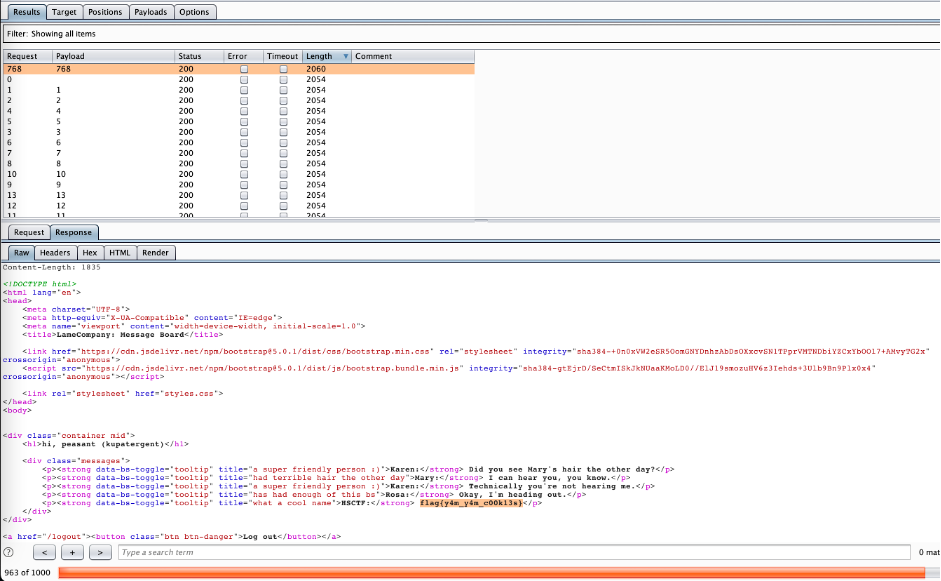

# HSCTF8 - message-board

- Write-Up Author: Wendy \[[MOCTF](https://www.facebook.com/MOCSCTF)\]

- Flag:**flag{y4m_y4m_c00k13s}**
## **Question:**
message-board



## Write up:

From the question, it provided the credentials for the login page. After login, the first thing We discover is the cookie session. 



After decoded the cookie, We see it includes userID and username information.



From the source code, we know the user schema for the cookie. Then we try to brute force the admin's userID. Finally, we got the flag. 

```
const users = [
    {
        userID: "972",
        username: "kupatergent",
        password: "gandal"
    },
    {
        userID: "***",
        username: "admin"
    }
]

app.get("/", (req, res) => {
    const admin = users.find(u => u.username === "admin")
    if(req.cookies && req.cookies.userData && req.cookies.userData.userID) {
        const {userID, username} = req.cookies.userData
        if(req.cookies.userData.userID === admin.userID) res.render("home.ejs", {username: username, flag: process.env.FLAG})
        else res.render("home.ejs", {username: username, flag: "no flag for you"})
    } else {
        res.render("unauth.ejs")
    }
})
```




>flag{y4m_y4m_c00k13s}

