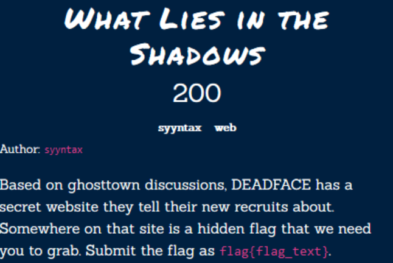
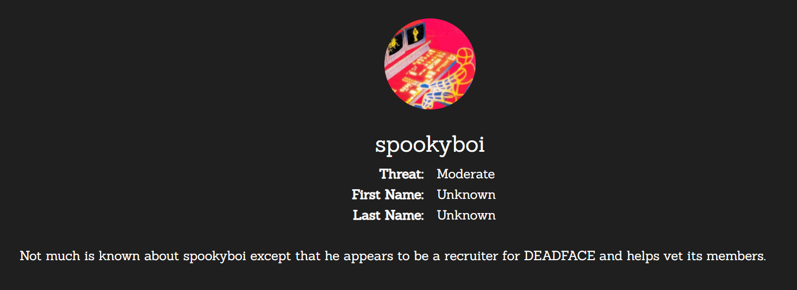
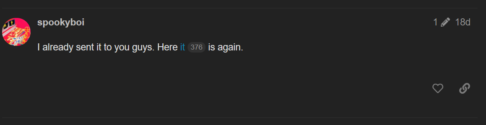
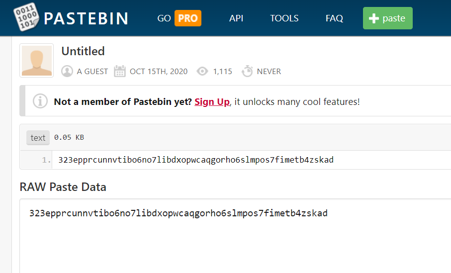
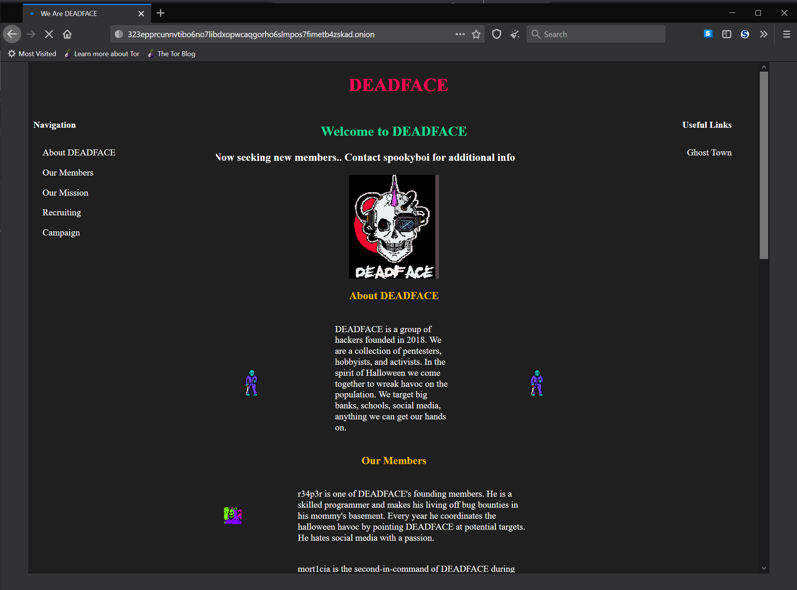
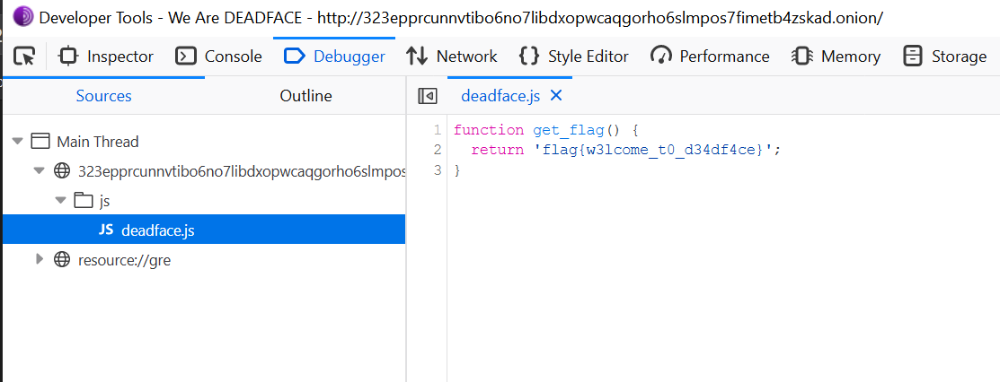

# Hacktober2020 - What Lies In The shadows

- Write-Up Author: Rb916120 \[[MOCTF](https://www.facebook.com/MOCSCTF)\]

- Flag:flag{w3lcome_t0_d34df4ce}

## **Question:**
What Lies In The shadows

## Write up
**First, below tool required in this article.** 
[Tor Browser](https://www.torproject.org/) -  all in one browser powered by Firefox that let you easy to surf onion network a.k.a **drak web**

**reference:** 
[Onion routing](https://en.wikipedia.org/wiki/Onion_routing)

the chall mentioned ghosttown is a forum, we can search in google for the result. 
https://www.ghosttown.xyz/

according to the [Intel page](http://ctf.cyberhacktics.com/intel). spookyboi is the recruiter person. 

search spookyboi in ghost town there is only 1 relevance post. 
https://www.ghosttown.xyz/t/trick-or-treat-smell-my-feet/52/5 

and spookyboi give a link https://pastebin.com/vbQZ7xwL that store a onion address. 

launch Tor browser, and go to http://323epprcunnvtibo6no7libdxopwcaqgorho6slmpos7fimetb4zskad.onion/ 
we will see the recruiter page 

inspect the file, we could find the flag 

>flag{w3lcome_t0_d34df4ce}