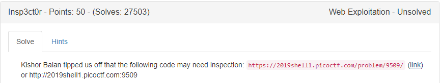
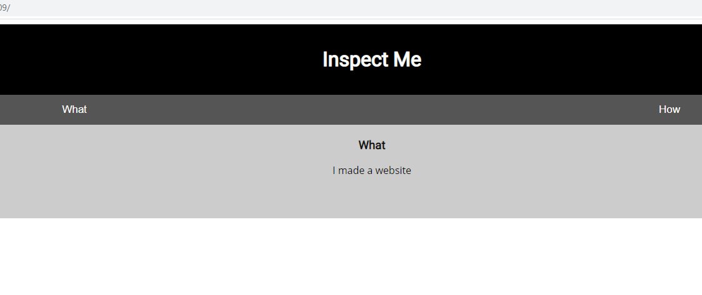
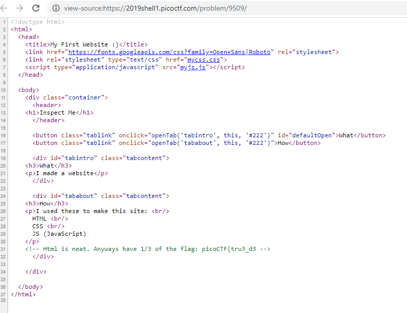
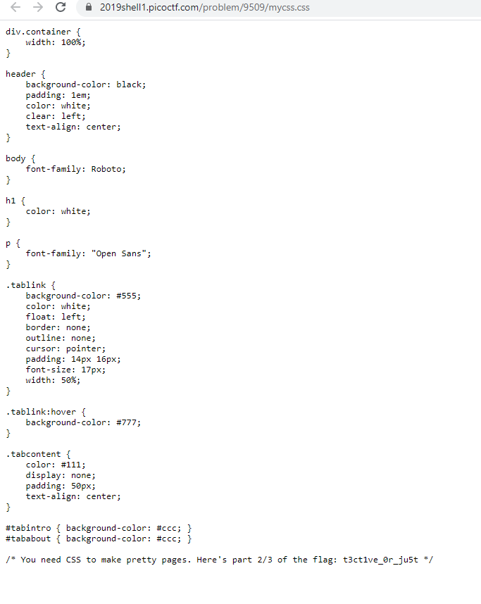
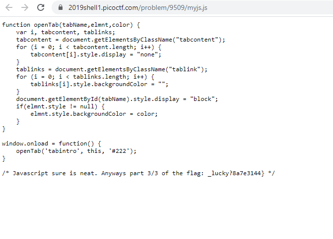

# PICO2019 - Insp3ct0r

- Write-Up Author:\[[MOCTF](https://www.facebook.com/MOCSCTF)\]

- Flag:**picoCTF{tru3_d3t3ct1ve_0r_ju5t_lucky?8a7e3144}**
## **Question:**
>Insp3ct0r

Link: https://2019shell1.picoctf.com/problem/9509/
## Write up:

>Open the web page see  a simple web page:

>Right click on the web page, click “view source” (Or similar depends on the browser you use):

>You can see 1/3 of the flag in comment. Further click mycss.css and myjs.js:

 
>You can further get 2/3 and 3/3 of the flag. Combine together the whole flag is:

picoCTF{tru3_d3t3ct1ve_0r_ju5t_lucky?8a7e3144}

