# PICOCTF2019 - Logon

- Write-Up Author: Teru Lei \[[MOCTF](https://www.facebook.com/MOCSCTF)\]

- Flag:**picoCTF{th3_c0nsp1r4cy_l1v3s_2e19dad3}**
## **Question:**
>Logon

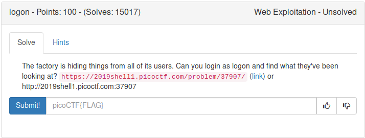

## Write up:

>Open the web page:
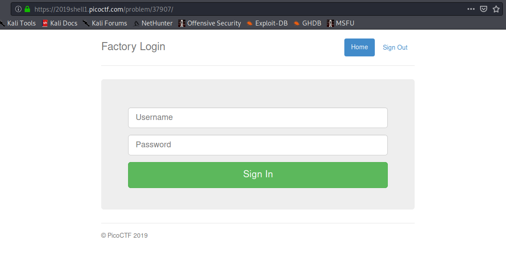

>The question mentioned that “login as logon”, so the username should be “logon”. First step try to observe the source code, no special.
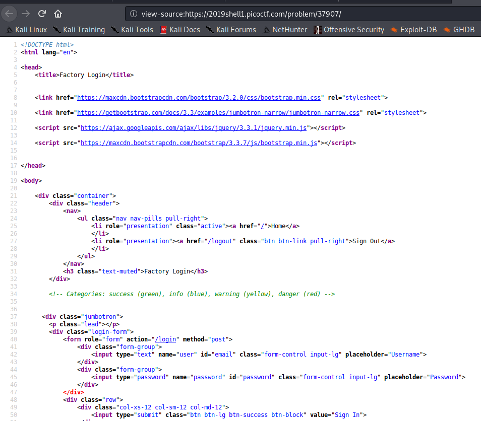

>Then try to login with user “logon” and try some simple password (e.g. password”) to observe the reaction of the webpage:
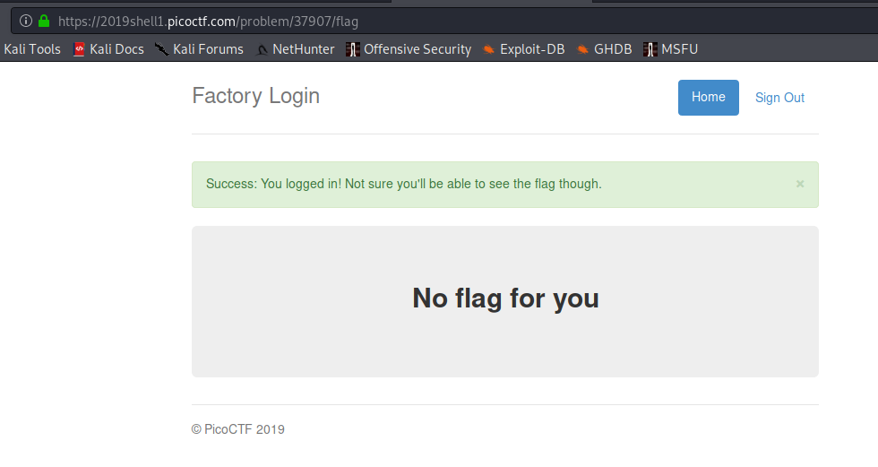

>It’s login anyway but no flag. Observe the source code again, same no special was found:
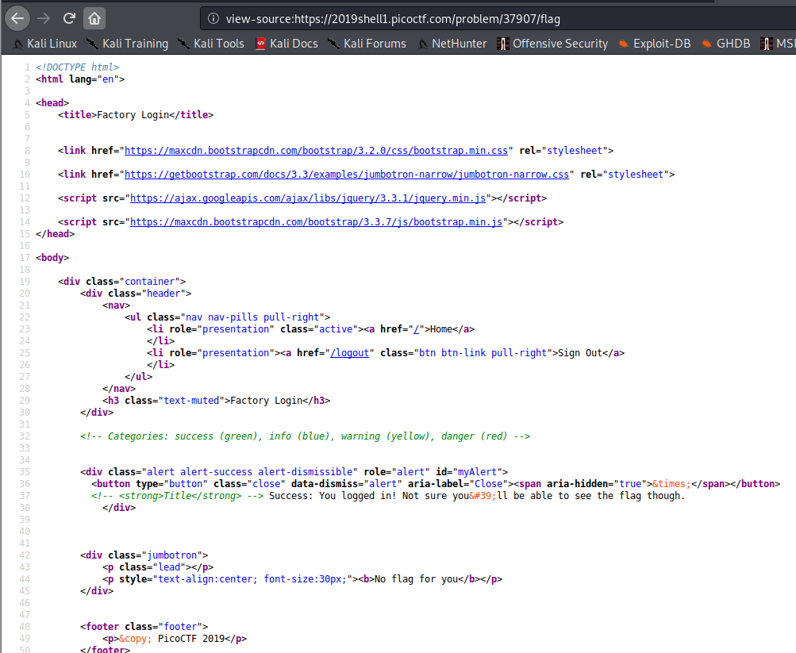

>Next step we may try to observe the request and response of the web link, and if necessary, modify the web request or reply. BurpSuite community edition is one of the most popular tool to do this task. BurpSuite community edition come with Kali Linux already. Open BurpSuite, select “Temporary Project”, then click “Next”.
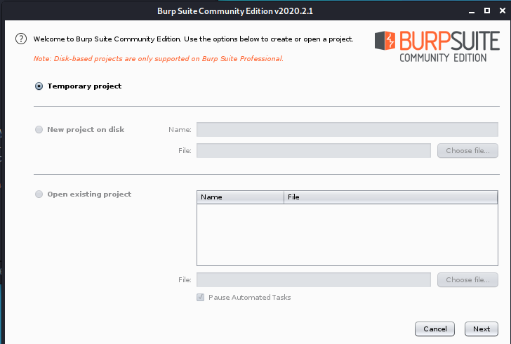

>Keep “Use Burp defaults”, then click “Start Burp”
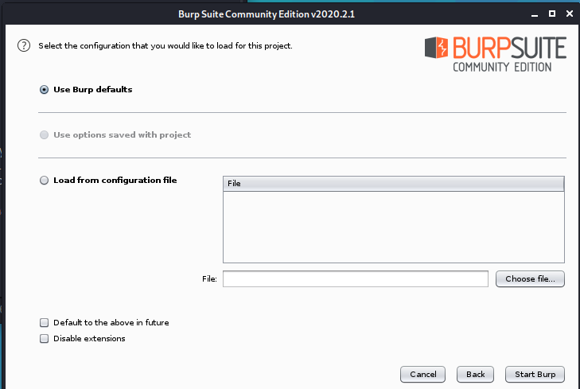

>Click “Proxy” tab, make sure “Intercept is on”:
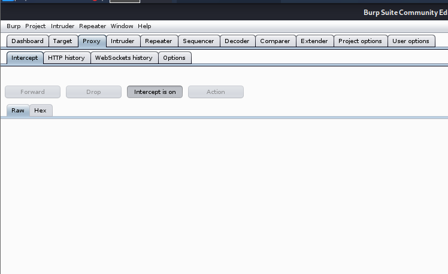

>Open the browser of your machine, point your browser proxy IP to 127.0.0.1, port 8080, so that the browser outgoing traffic will be intercepted by BurpSuite:
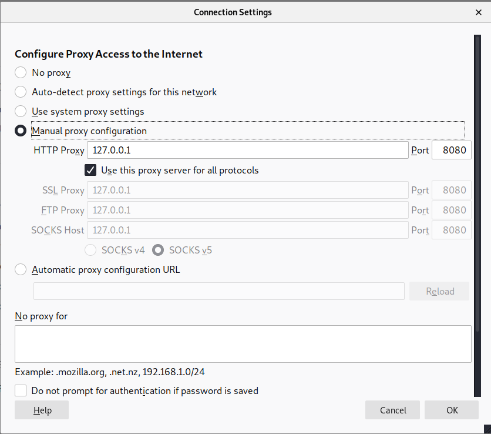

>Browse the web page, BurpSuite will intercept the traffic:
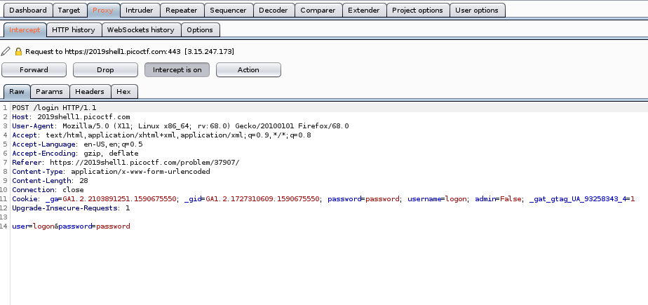
 
>Observe the cookie, there is “admin=False”, it’s interesting, possibly the flag needs to be achieved by admin. So we can try to change the cookie to “admin=True”. In order to clearly observe the response from web server, we can highlight the raw web request in BurpSuite, right click then choose to intercept the response of the request, then press “Forward”:
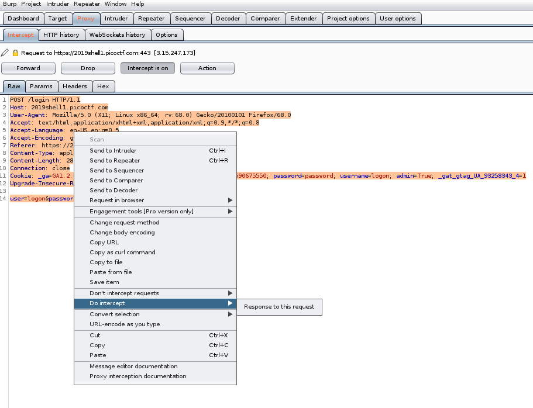

>We can observe there is redirection from web server:
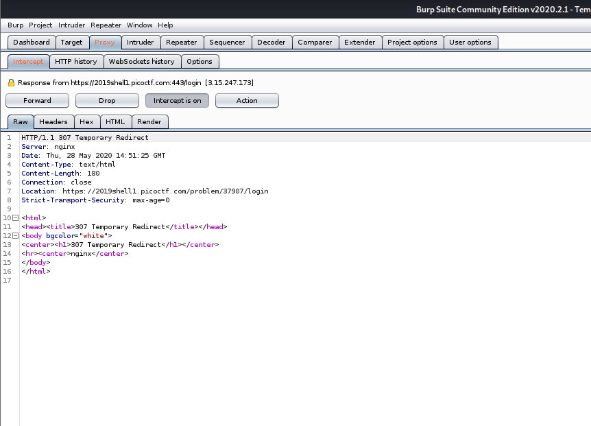

>The response will set back “admin=False”, try to set back to “admin=True” again but still cannot get the flag:
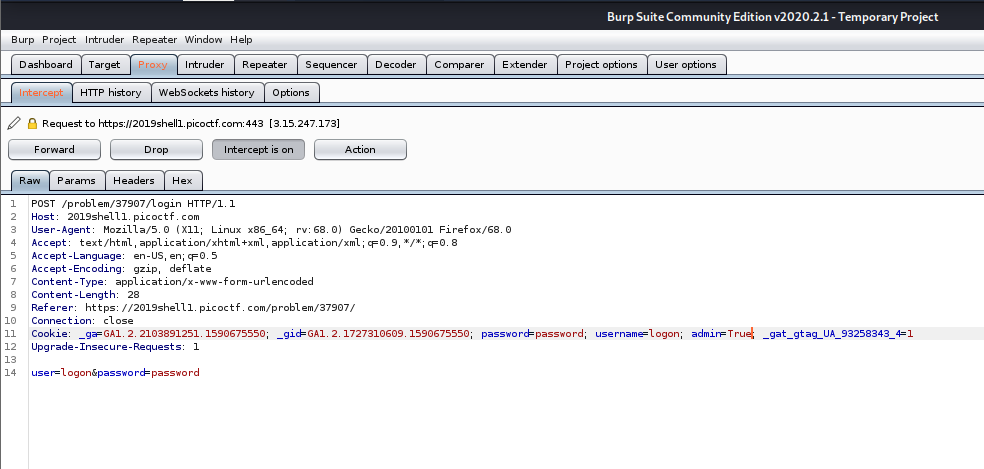

>There is hint in the question:
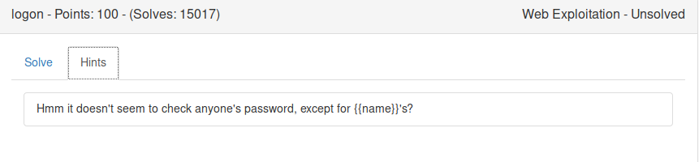

>With the hint, we can try to remove the password part in the cookie, try again, then we can get the flag:
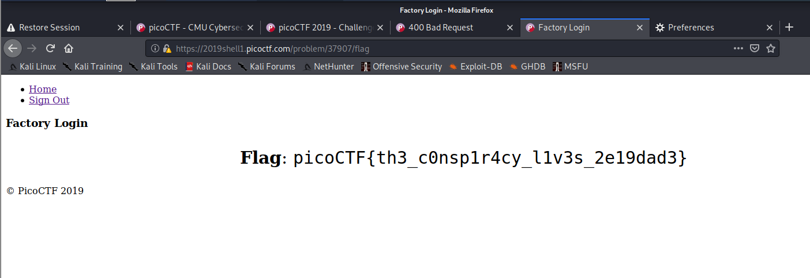

