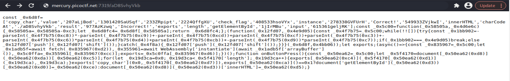
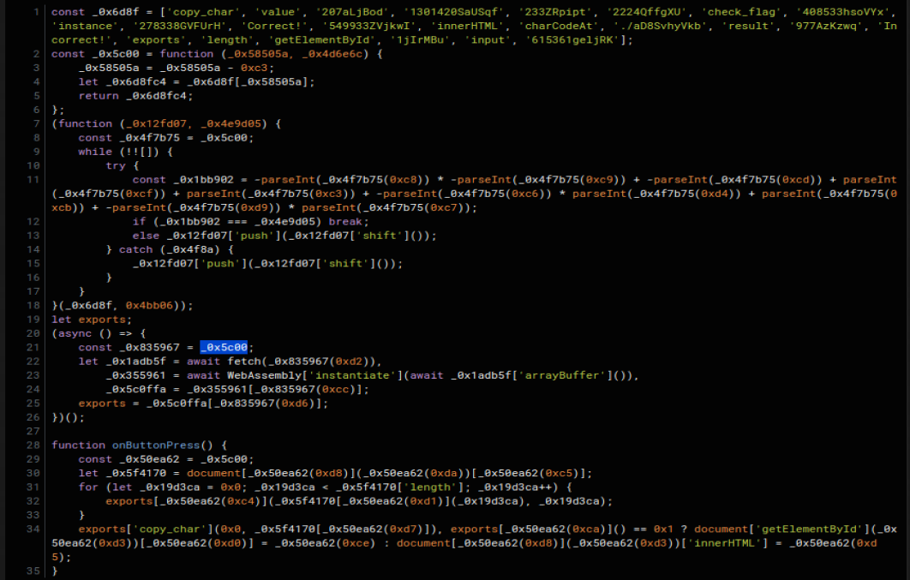
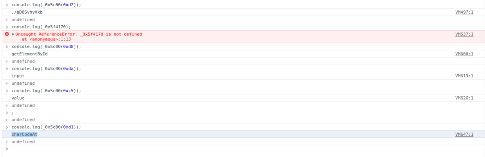
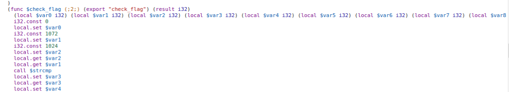
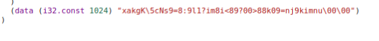
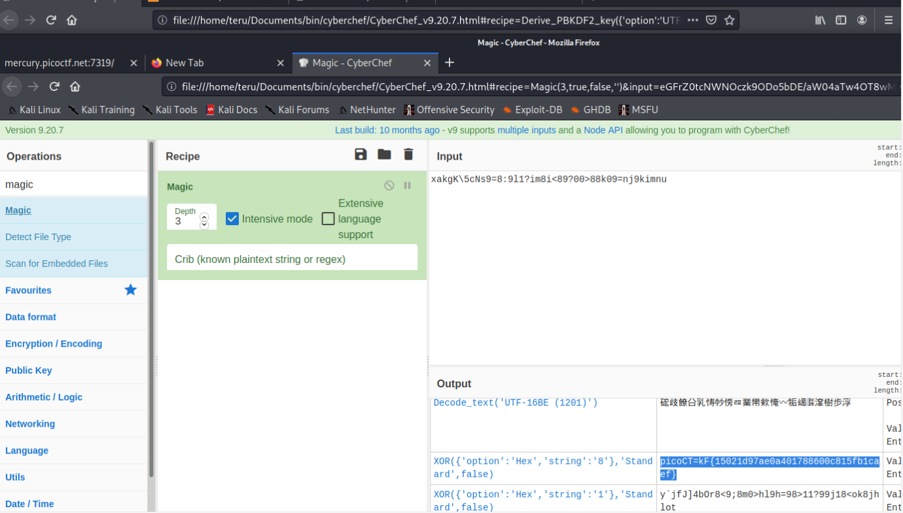
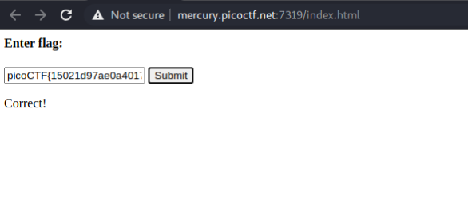

#PicoCTF2021 - Required Assembly 2

- Write-Up Author: Teru Lei \[[MOCTF](https://www.facebook.com/MOCSCTF)\]

- Flag:**picoCTF{15021d97ae0a401788600c815fb1caef}**
## **Question:**
>Required Assembly 2


## Write up:
>1.	Use BurpSuite to capture the server return:
```
<html>
<head>
	<meta charset="UTF-8">
	<script src="Y8splx37qY.js"></script>
</head>
<body>
	<h4>Enter flag:</h4>
	<input type="text" id="input"/>
	<button onclick="onButtonPress()">Submit</button>
	<p id="result"></p>
</body>
</html>
```

>2.	Further the Javascript in the code above, the code is like this:


>3.	Use some [Javascript Beautifier](https://lelinhtinh.github.io/de4js/) to make the code more readable:


>4.	Pay attention to the below part of the code:


We can get to know that i) Webassembly code is coded in the script and ii) There are some action taken when clicking the button in the page but from the current code it’s still very difficult to get to know what action is performed yet.

>5.	Let’s try to make the code more readable by checking out the obfuscated variables and functions. Press F12 in your browser after loading the page, select console.
```
Since _0x835967 = _0x5c00, but there is error when execute ‘console.log(_0x835967(0xd2))’, so we try ‘console.log(_0x5c00(0xd2))’, got output ‘./aD8SvhyVkb’, which we can get to know it’s a WebAssembly file from the code. Similar, we can make the code of onButtonPress function more clear that ‘document[_0x50ea62(0xd8)](_0x50ea62(0xda))[_0x50ea62(0xc5)]’ means ‘document[getElementById][input][value]’ and ‘exports[_0x50ea62(0xc4)](_0x5f4170[_0x50ea62(0xd1)](_0x19d3ca), _0x19d3ca)’ means ‘exports['copy_char'](document[‘charCodeAt’] (_0x19d3ca),_0x19d3ca)’. Also ‘exports[_0x50ea62(0xca)]() == 0x1’ means exports[‘check_flag’]() == 0x1
```


>6. At this point, with trying to play around the web page for a few time, we can get to know that the logic of the script is to call the WebAssembly code then when press the Submit button in the page, there is some comparison performed by the WebAssembly code and if you input the flag then the page will show correct otherwise the page will show incorrect when you press the Submit button.

>7.	Next step is to investigate the WebAssembly code. Actually you can read the code by pressing F12 in your browser and choose ‘Sources’ tab:


>8.	There are 3 functions found in the code, copy_char, check_flag and strcmp. It may be a bit difficult to interpret the exact logic of the code but considering the logic of script, the check_flag function should be the logic to compare input with the flag and we find that the check_flag function call strcmp function. And also there is a constant variable which is a string in the code.


>9.	With the information gathered, one possible way is that the constant variable (the string) compares with the input of web page (it’s the flag if the input is correct) after some manipulation or the reverse. So simply try to copy the string to CyberChef to try some general mechanism:


>Bingo, we get the flag and try to input to the web page:


