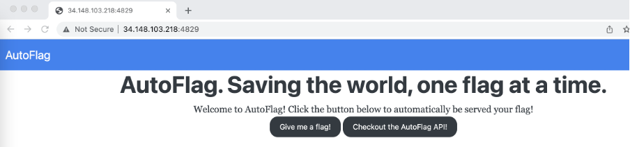
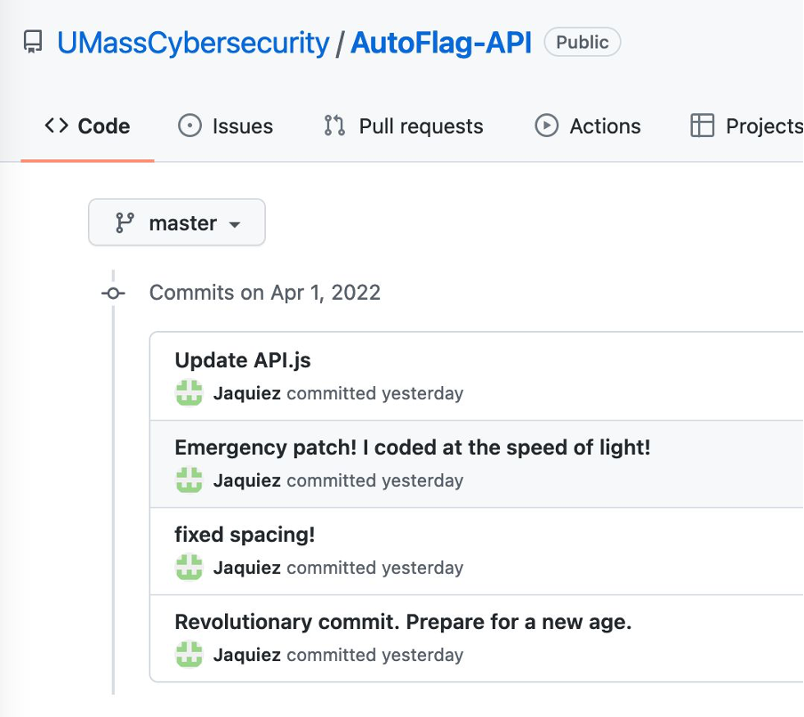
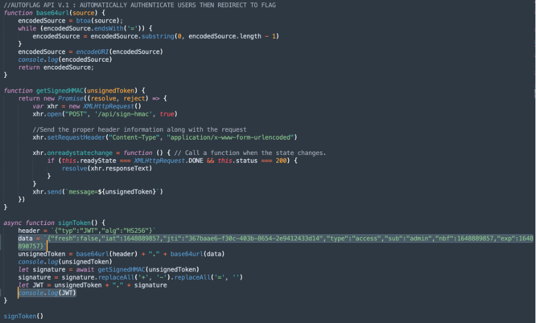
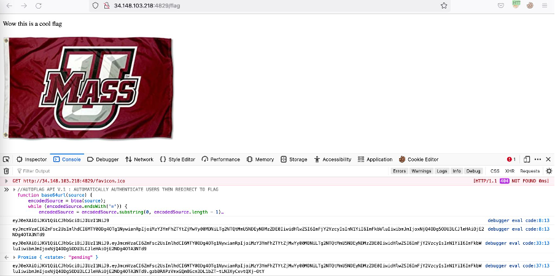
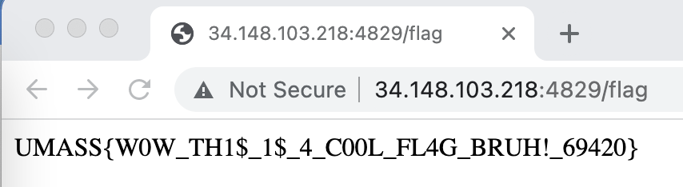

# UMassCTF 2022 - autoflag
- Write-Up Author: Wendy \[[MOCTF](https://www.facebook.com/MOCSCTF)\]

- Flag: UMASS{W0W_TH1$_1$_4_C00L_FL4G_BRUH!_69420}

## **Question:**
autoflag

>Challenge description

My friend made this website that automatically serves you a flag. He says he patched it recently and would pay me 100 v-bucks if I could get his super secret flag. Please help me out!!!

http://34.148.103.218:4829

## Write up

First, there are two buttons on the website. One is "give me a flag!", another one is "Checkout the AutoFlag API".



When I click "give me a flag!", it's just fake flag. Then I try to tamper the JWT cookies, it does not work.

Therefore, I check out the AutoFlag API to see any hints from Github. Great, I discover the JWT token generation function under commit history.



```
 //AUTOFLAG API V.1 : AUTOMATICALLY AUTHENTICATE USERS THEN REDIRECT TO FLAG
function base64url(source) {
    encodedSource = btoa(source);
    while (encodedSource.endsWith('=')) {
        encodedSource = encodedSource.substring(0, encodedSource.length - 1)
    }
    encodedSource = encodeURI(encodedSource)
    console.log(encodedSource)
    return encodedSource;
}

function getSignedHMAC(unsignedToken) {
    return new Promise((resolve, reject) => {
        var xhr = new XMLHttpRequest()
        xhr.open("POST", '/api/sign-hmac', true)

        //Send the proper header information along with the request
        xhr.setRequestHeader("Content-Type", "application/x-www-form-urlencoded")

        xhr.onreadystatechange = function () { // Call a function when the state changes.
            if (this.readyState === XMLHttpRequest.DONE && this.status === 200) {
                resolve(xhr.responseText)
            }
        }
        xhr.send(`message=${unsignedToken}`)
    })
}

async function signToken() {
    header = `{"typ":"JWT","alg":"HS256"}`
    data = `{"fresh":false,"iat":1648889857,"jti":"367baae6-f30c-403b-8654-2e9412433d14","type":"access","sub":"admin","nbf":1648889857,"exp":1648890757}`
    unsignedToken = base64url(header) + "." + base64url(data)
    console.log(unsignedToken)
    let signature = await getSignedHMAC(unsignedToken)
    signature = signature.replaceAll('+', '-').replaceAll('=', '')
    let JWT = unsignedToken + "." + signature
    console.log(JWT)
}

signToken()

```

I update the highlighted part as below.



After that, I access http://34.148.103.218:4829/flag and run the JavaScript code on browser console.



Finally, I use the JWT token output as the cookies and refresh the http://34.148.103.218:4829/flag. I get the flag!



> UMASS{W0W_TH1$_1$_4_C00L_FL4G_BRUH!_69420}
