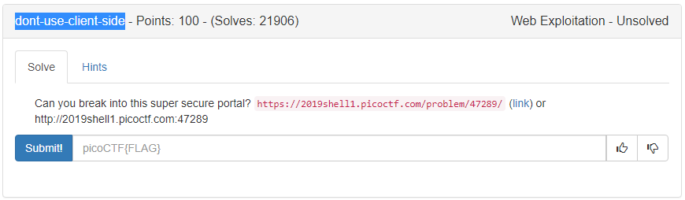
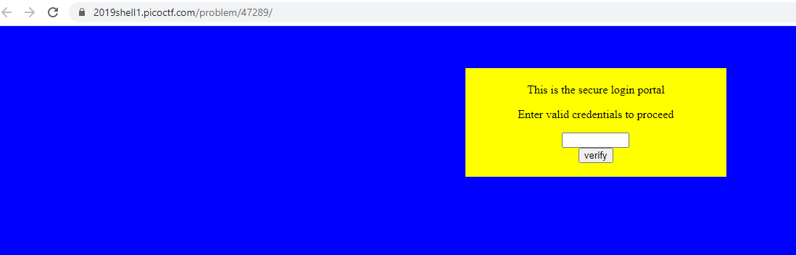
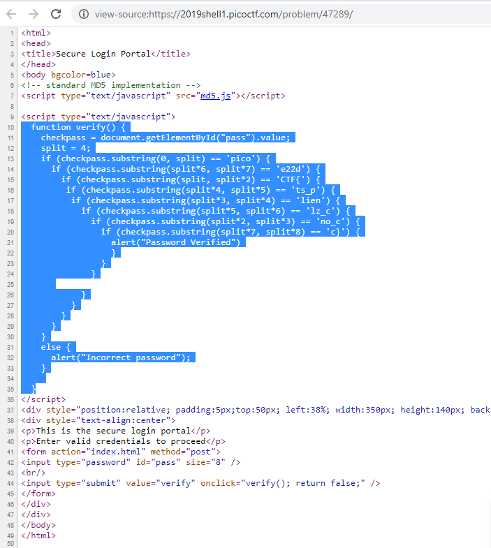
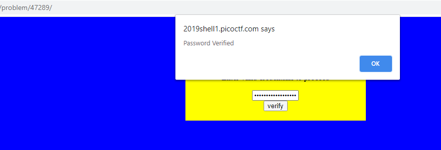

# PICOCTF2019 - dont-use-client-side

- Write-Up Author: Teru Lei \[[MOCTF](https://www.facebook.com/MOCSCTF)\]

- Flag:**picoCTF{no_clients_plz_ce22dc}**
## **Question:**
>dont-use-client-side



## Write up:

>Open the webpage, it’s a page for password validation



>Right click the page, and view source:


>By observing the highlighted code, we can get to know that the password validation is performed on client side instead of server side, and the whole password is broken down to multiple 4 characters substring for validation. (You can get this idea by variable split = 4, and checkpass.substring())
Put the substrings in sequence, you can get the below:

```javascript
	checkpass.substring(0, split) == 'pico'
	checkpass.substring(split, split*2) == 'CTF{'
	checkpass.substring(split*2, split*3) == 'no_c'
	checkpass.substring(split*3, split*4) == 'lien'
	checkpass.substring(split*4, split*5) == 'ts_p'
	checkpass.substring(split*5, split*6) == 'lz_c'
	checkpass.substring(split*6, split*7) == 'e22d'
	checkpass.substring(split*7, split*8) == 'c}'
```

>Put those substring together, the password is ‘picoCTF{no_clients_plz_ce22dc}’ which is the flag. Back the webpage the password verified message is shown:

